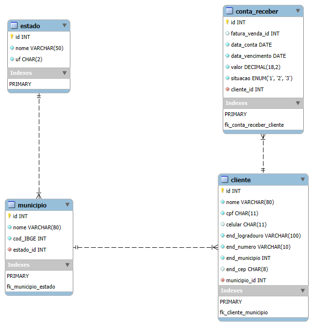

# 🧠 Estudo e Prática de SQL

Projeto desenvolvido com **MySQL Workbench**, voltado para aprendizado e prática de SQL.

---

## 📂 Estrutura dos Scripts

Os arquivos estão organizados para facilitar a criação do banco e a inserção dos dados:

| Ordem | Arquivo                          | Descrição                                  |
|-------|----------------------------------|--------------------------------------------|
| 1️⃣   | `01_create_tabelas.sql`          | Criação das tabelas do banco               |
| 2️⃣   | `02_insert_estados_municipios.sql` | Inserção de dados de estados e municípios  |
| 3️⃣   | `03_insert_clientes.sql`         | Inserção dos dados dos clientes            |
| 4️⃣   | `04_insert_contas_receber.sql`   | Inserção das contas a receber              |
| 5️⃣   | `05_views.sql`                   | Criação da view `contas_pagas`             |

---

## 🚀 Como executar

1. Clone o repositório
2. Abra os arquivos no **MySQL Workbench**
3. Execute os scripts na ordem listada acima

---

## ✅ Requisitos

- MySQL instalado
- MySQL Workbench

---

## 🗺️ Diagrama Entidade-Relacionamento (DER)

O projeto também inclui o diagrama visual do banco de dados, disponível em dois formatos:

- `docs/der.png` (visualização rápida)
- `models/modelo-banco.mwb` (editável no Workbench)

---

## 📌 Observações

- Os nomes de tabelas e colunas seguem o padrão `snake_case`
- Os dados inseridos são fictícios e com fins didáticos
- Projeto base disponível em: [Dia a Dia do Suporte](https://www.youtube.com/watch?v=p1w_1HSg8BY&list=PLO5rsoBNVkNonB8L7XDZPW_iDzSAyswjZ&index=28)

---
